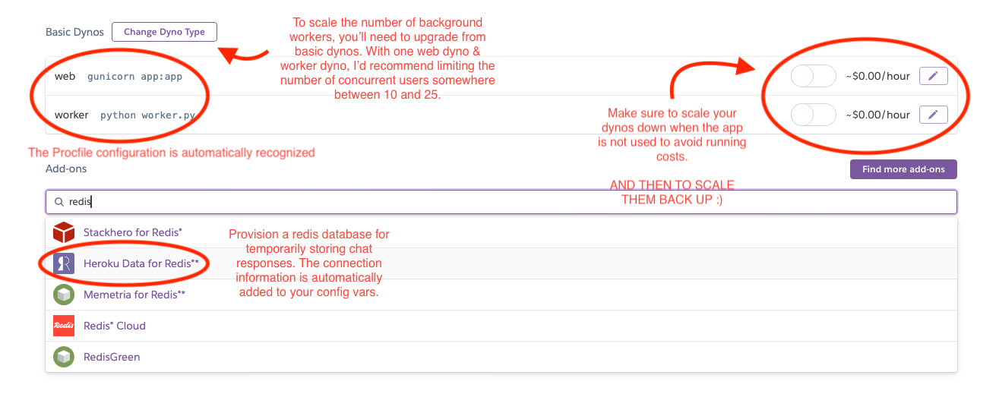
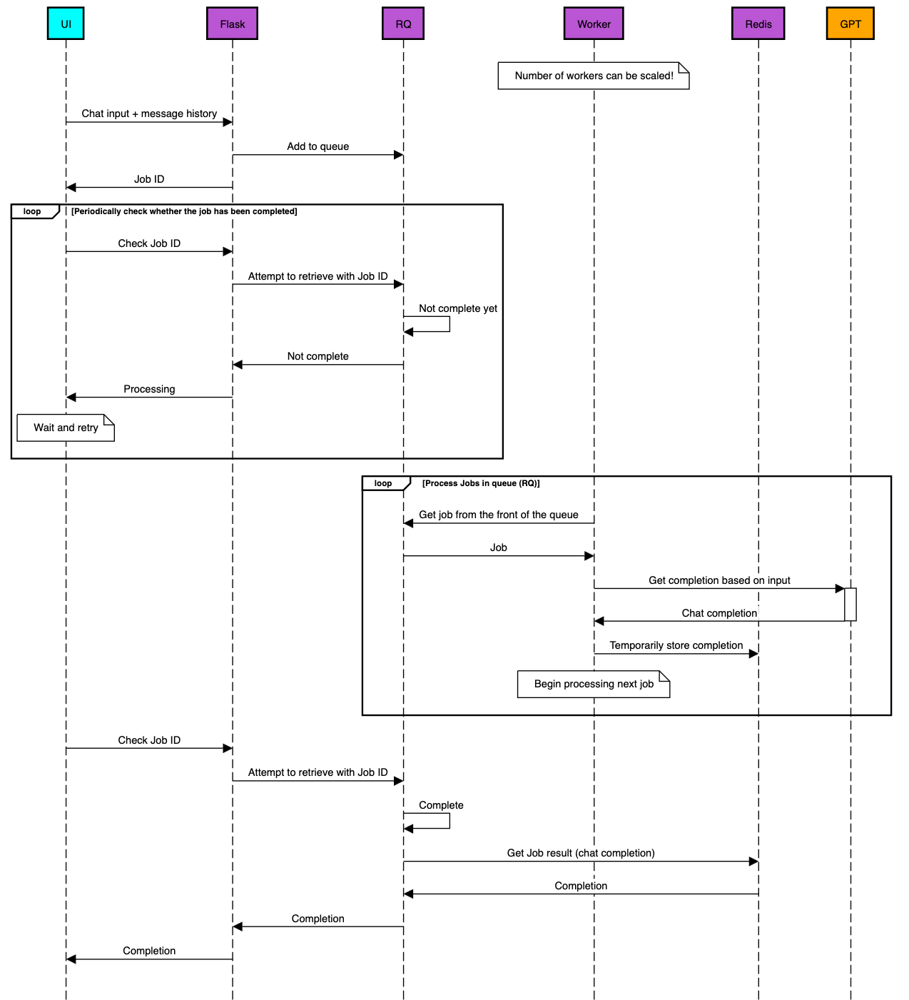

# Chat + Tasks (Proxy Server)

The backend for our online study application. Handles messaging with GPT-4 and saving responses to the database. You can find the participant-facing application [here](https://github.com/aaltoengpsy/chat-tasks-frontend).

- [Running Locally](#running-locally)

  - [Setup](#setup)

  - [Run](#run)

- [Deploying Online](#deploying-online)

- [Queue Management](#queue-management)

- [Retrieving Data from the Database](#retrieving-data-from-the-database)

## Overview

The repository features a Flask server (`app.py`) offering three endpoints: `/chat`, `/save` and `/check_participation`. The first of these is used to communicate with the OpenAI API to complete ChatGPT prompts (including pre-encoded images, if included) entered by participants using the study's frontend. The latter two are offered for checking participation and dumping participation data to an attached MongoDB database.

Participation data is only saved if the supplied participant ID does not already exist in the database. `database_helpers.py` contains helper functions that use the `pymongo` librabry to connect to the database as well as to insert new entries and check for existing entries with a given identifier.

## Running Locally

### Setup

Start by creating a MongoDB database. You should be able to get by with the free tier on [Atlas](https://www.mongodb.com/atlas) to get started. You can upgrade to a paid tier or a managed version from e.g. [DigitalOcean](https://www.digitalocean.com/products/managed-databases-mongodb) later on.

Then, clone or download this repository and navigate to its root folder.

**(Recommended)** Create a new conda environment with Python and activate it:

```bash
$ conda create -n chat-tasks python

...

$ conda activate chat-tasks
```

Install the required dependencies:

```bash
$ pip install -r requirements.txt
```

Create your `.env` file:

```bash
$ touch .env
```

Add in the URLs of your frontend and database, your OpenAI API key, GPT parameters, the name of the database you wish your data to be stored in and the completion code & url for your study.

```.env
OPENAI_API_KEY=api_key_here
GPT_VERSION=gpt-4-turbo
GPT_TOKEN_LIMIT=1000                     
FRONTEND_URL=frontend_url_here          # http://localhost:5173 by default
DATABASE_URL=mongodb_url_here
DATABASE_NAME=database_name_here        # Name of the database within the cluster that DATABASE_URL points to
PROLIFIC_CODE=prolific_return_code_here # Completion code to be displayed to the participant (not necessarily prolific)
PROLIFIC_URL=prolific_return_url_here   # Completion url to be displayed to the participant (not necessarily prolific)
```

[Install redis](https://redis.io/docs/latest/operate/oss_and_stack/install/install-redis/) locally; we need this for [queue management](#queue-management).

### Run

MacOS users can simply use the premade script in `run_osx.sh`:

```bash
$ chmod u+x run_osx.sh
$ ./run_osx.sh
```

Windows & Linux users need to perform this manually (though you're free to write your own scripts!). First, open three terminals. In the first two, navigate to the root of the repository and activate the conda environment.

In the first one, start the Flask app:
```bash
$ flask run
```

In the second one, start the background worker that is responsible for processing queued chat requests:
```bash
$ python worker.py
```

In the third one, start redis, which is used to store completed chat requests until the client fetches them:
```bash
$ redis-server
```

You're all set! Remember to update your frontend's .env file as well so that it points to the address of the server! 😄

## Deploying Online

The repository should be deployable to e.g. [Heroku](https://www.heroku.com/) or [DigitalOcean's App Platform](https://www.digitalocean.com/products/app-platform) directly from GitHub. Create a project, connect your GitHub and select the repository. This should then automatically provision one dyno/droplet for both the main process and the background worker respectively. You should also provision a redis database for the project as that's where completed chat queries are stored.

Here's how to configure the resources on Heroku after uploading the app:



If you're having issues, see the respective instructions for Heroku
- [Deploying a worker & provisioning redis from the CLI](https://devcenter.heroku.com/articles/python-rq#deployment)
- [Redis add-on page (can provision from here)](https://elements.heroku.com/addons/heroku-redis)

...and DigitalOcean
- [Adding workers](https://docs.digitalocean.com/products/app-platform/how-to/manage-workers/#add-a-worker-using-the-control-panel)
- [Connecting redis to app platform](https://www.digitalocean.com/community/questions/how-can-i-add-redis-as-a-component-to-my-app-in-app-platform?comment=169618)

Remember to set your environment variables ("Config Vars" on Heroku)! Also update your frontend deployment's environment variables to point to the address of the deployed server.

## Queue Management

Because GPT calls can take long to process, they should be run as a background job to avoid request timeouts. This project uses [RQ](https://python-rq.org/) to queue API calls.

When the `/chat` API endpoint is called, the fulfillment of the OpenAI API request is moved to a queue and a unique job id is returned to the client. The background worker (in `worker.py`) then executes the query, saves the associated GPT response to the temporary redis database, and marks the job as `finished`.

The client can then check whether the request has been completed by calling the `/check_response` endpoint and including the job id in the request body. If the request has been completed, the full chat response will be returned. Otherwise, the field `processing` will be `True` and the client should re-check in a few moments. If the job has been failed, stopped or canceled for one reason or another, an error will be returned.



> **N.B.** Participation checks and participation data saving operations are not processed in the queue, as these should be relatively quick operations.

## Retrieving Data from the Database

For (hopefully obvious) security reasons (i.e. no authentication implementation), there is no way to fetch the contents of the database using this proxy API.

Once you are done collecting data for your study, you can use the `pymongo` library (included in `requirements.txt`) in a separate script (such as in an Jupyter notebook) to pull the contents of the database.

```python
client = MongoClient(DATABASE_URL)
db = client[DATABASE_NAME]             
collection = db[COLLECTION_NAME]

items = collection.find()           # Fetches all items from the specified collection
```

`items` is be *iterable*, so you will need to iterate through it to access the contents:

```python
for item in items:
    print(item)
```

`items` is also *consumed* when it's iterated upon, so to access its contents again, you will need to either fetch it again:

```python
items = collection.find()
```

**OR**, you can clone the contents to a separate variable when you fetch the items the first time:

```python
items_consumable = collection.find()
items_to_reuse = items_consumable.clone()

for item in items_to_reuse:
    # DO STUFF HERE
    pass
```

Alternatively, you can use the [mongoexport tool](https://www.mongodb.com/docs/database-tools/mongoexport/) to extract the contents of the database.